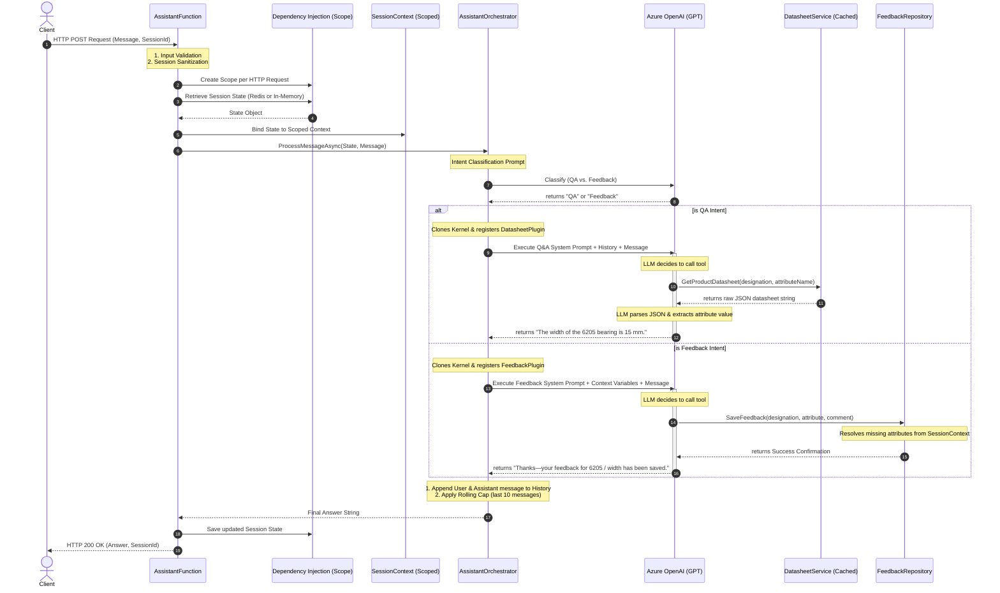

# Architecture Review Document - Mini Product Assistant

This document reviews the technical architecture, design patterns, security baselines, and execution flow of the Mini Product Assistant project.

---

## 1. Architectural Design & Flow

The application is structured around a decoupled, service-oriented design following clean architecture principles. It leverages Microsoft Semantic Kernel (C#) to orchestrate Q&A and Feedback agents, exposing a single HTTP REST endpoint.

### Execution Flow Diagram

The diagram below maps the lifecycle of a request through the system:

---

## 2. Component Directory

| Component / Layer | Responsibility | Lifetime | Symbol / Link |
| --- | --- | --- | --- |
| **HTTP Trigger** | Handles low-level HTTP protocols, body extraction, request model binding, schema validations, and global exception boundaries. | Scoped | [AssistantFunction](file:///c:/Users/gonzalo_t/source/prepo/ABCCons/ABCCons.Function/AssistantFunction.cs) |
| **Orchestrator** | Classifies incoming message intents and creates specialized, tool-isolated LLM agent kernels to execute the routed request. | Scoped | [AssistantOrchestrator](file:///c:/Users/gonzalo_t/source/prepo/ABCCons/ABCCons.Function/Orchestration/AssistantOrchestrator.cs) |
| **Session Context** | Shares the active request's state dynamically across decoupled boundary handlers, controllers, and plugins. | Scoped | [SessionContext](file:///c:/Users/gonzalo_t/source/prepo/ABCCons/ABCCons.Function/Services/SessionContext.cs) |
| **Authoritative Reader** | Performs raw JSON loading of local bearing datasheets and caches them in memory. | Singleton | [DatasheetService](file:///c:/Users/gonzalo_t/source/prepo/ABCCons/ABCCons.Function/Services/DatasheetService.cs) |
| **Q&A Tooling** | Exposes `GetProductDatasheet` to the Semantic Kernel agent to return the raw JSON datasheet, delegating matching and synonyms to the LLM (Option A). | Transient | [DatasheetPlugin](file:///c:/Users/gonzalo_t/source/prepo/ABCCons/ABCCons.Function/Plugins/DatasheetPlugin.cs) |
| **Feedback Tooling** | Exposes feedback logging interfaces to the Feedback agent, resolving missing data points using the shared context. | Transient | [FeedbackPlugin](file:///c:/Users/gonzalo_t/source/prepo/ABCCons/ABCCons.Function/Plugins/FeedbackPlugin.cs) |
| **State Store** | Contracts for saving session history and logs across requests, featuring memory and Redis adapters. | Singleton | [IStateStore](file:///c:/Users/gonzalo_t/source/prepo/ABCCons/ABCCons.Function/Services/IStateStore.cs) |

---

## 3. Design Principles (SOLID) Analysis

### Single Responsibility Principle (SRP)
Each class focuses strictly on one task:
- [DatasheetService](file:///c:/Users/gonzalo_t/source/prepo/ABCCons/ABCCons.Function/Services/DatasheetService.cs) parses JSON datasheets; it has no knowledge of LLM prompts or HTTP responses.
- [AssistantFunction](file:///c:/Users/gonzalo_t/source/prepo/ABCCons/ABCCons.Function/AssistantFunction.cs) handles HTTP protocols; it does not contain orchestrator routing or parsing code.
- [SessionContext](file:///c:/Users/gonzalo_t/source/prepo/ABCCons/ABCCons.Function/Services/SessionContext.cs) only holds the context reference; it doesn't process state updates.

### Open/Closed Principle (OCP)
The lookup mechanism is open to new bearing formats (the engine dynamically parses and scans JSON models without hardcoded schemas) and new state backends. We can introduce other databases (e.g., Azure Cosmos DB) simply by implementing [IStateStore](file:///c:/Users/gonzalo_t/source/prepo/ABCCons/ABCCons.Function/Services/IStateStore.cs) without modifying the orchestrator or controller.

### Liskov Substitution Principle (LSP)
The [InMemoryStateStore](file:///c:/Users/gonzalo_t/source/prepo/ABCCons/ABCCons.Function/Services/InMemoryStateStore.cs) and [RedisStateStore](file:///c:/Users/gonzalo_t/source/prepo/ABCCons/ABCCons.Function/Services/RedisStateStore.cs) can be swapped interchangeably in the host configuration without breaking the behavior of the application trigger or downstream code.

### Dependency Inversion Principle (DIP)
High-level modules (the orchestrator and plugins) do not depend on low-level databases or filesystem helpers directly. They interact solely via abstractions ([IDatasheetService](file:///c:/Users/gonzalo_t/source/prepo/ABCCons/ABCCons.Function/Services/IDatasheetService.cs), [IStateStore](file:///c:/Users/gonzalo_t/source/prepo/ABCCons/ABCCons.Function/Services/IStateStore.cs), and [IFeedbackRepository](file:///c:/Users/gonzalo_t/source/prepo/ABCCons/ABCCons.Function/Services/IFeedbackRepository.cs)).

---

## 4. Hallucination Controls & Prompt Hardening

To prevent Azure OpenAI from fabricating values ("hallucinating") when queries fall outside the local datasheets, the following safeguards are implemented:

1. **Tool-Isolated Kernels (Context Sanitization)**:
   The orchestrator clones the primary `Kernel` and registers *only* the specific tool required for that agent's scope. The Q&A agent cannot call feedback commands, and the Feedback agent cannot trigger data queries. This locks the prompt scope and prevents tool-crossover hallucination.
2. **Grounded-Only System Prompts**:
   The Q&A agent's prompt strictly forbids the model from guessing or assuming values. It dictates that values *must* come from the JSON datasheet returned by the `GetProductDatasheet` tool.
3. **Strict Fallback Abstention**:
   If the lookup tool returns that the datasheet does not exist, or if the attribute is missing from the JSON, the prompt dictates returning the exact fallback template: `Sorry, I can’t find that information for '[designation]'. Please try another designation or attribute.`

---

## 5. Security Baselines (OWASP)

- **Input Validation**: [AssistantFunction](file:///c:/Users/gonzalo_t/source/prepo/ABCCons/ABCCons.Function/AssistantFunction.cs) performs strict null, empty, and payload size checks. It checks for invalid requests and returns `400 Bad Request` prior to loading session states.
- **Session Sanitization**: The session ID is trimmed and cleaned to prevent injection vectors, falling back to a securely generated random `Guid` if empty.
- **Secure Credentials Configuration**: API keys and Azure OpenAI resource endpoints are never stored in source code. They are configured as environment variables (or local settings) and injected via standard .NET Configuration providers.
- **Least Privilege DI scoping**: Database connections (`IConnectionMultiplexer`) and datasheet caches are singletons, whereas request-specific items (context, agents, plugins) use scoped and transient lifetimes to prevent cross-tenant memory leaks.

---

## 6. Future Paradigms & Architectural Decisions

During the architectural review, two potential paradigm shifts were analyzed and deliberately postponed/rejected in favor of the current in-process orchestration model:

### A. Semantic Kernel Agent Framework Migration
- **Description**: Migrating the Q&A and Feedback flows to use formal `ChatCompletionAgent` classes from the `Microsoft.SemanticKernel.Agents` package.
- **Evaluation**: 
  - *Pros*: Provides standardized agentic abstractions and handoff hooks.
  - *Cons*: The Agent core SDK is in pre-release/preview with high API volatility.
  - *Conclusion*: **Declined**. The current custom classification and routing is highly performant, lightweight, and compile-time safe for a simple 2-agent scenario, avoiding unnecessary preview library dependencies.

### B. Model Context Protocol (MCP) Integration
- **Description**: Moving the plugins (`DatasheetPlugin`, `FeedbackPlugin`) to a separate MCP Server (`ABCCons.McpServer`) and converting the Azure Function into an MCP Client.
- **Evaluation**:
  - *Pros*: Decoupled, reusable tool endpoints that can be consumed by any MCP-compliant client.
  - *Cons*: Introduces process/network latency. Additionally, decoupling makes request-scoped state context sharing (like mapping `SessionContext` variables across separate turns) much more complex as the server cannot natively access the client's HTTP request-scoped DI container.
  - *Conclusion*: **Declined**. Keeping the plugins compiled in-process allows direct, zero-latency access to the scoped request state store and session context.
